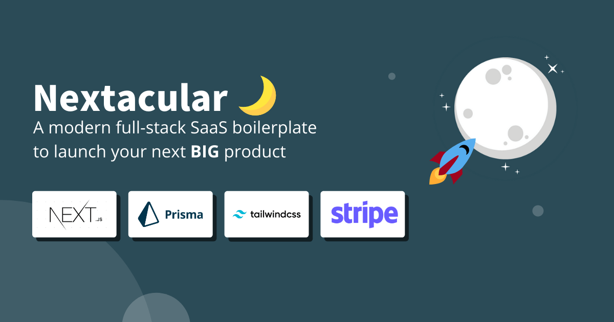

# Nextacular🌙

    

## Quickly launch multi-tenant SaaS applications



An open-source starter kit that will help you build full-stack multi-tenant SaaS platforms efficiently and help you focus on developing your core SaaS features. Built on top of popular and modern technologies such as Next JS, Tailwind, and Prisma

**Features** packaged out-of-the-box: **Authentication**, **Billing & Payment**, **Database**, **Email**, **Custom Domains**, **Multi-tenancy**, **Workspaces**, and **Teams**

## Live Demo

Nextacular Demo: [https://demo.nextacular.co](https://demo.nextacular.co)

## Documentation

Nextacular Documentation: [https://docs.nextacular.co](https://docs.nextacular.co)

## Getting Started

Read the quick start here: [https://docs.nextacular.co/getting-started/quick-start](https://docs.nextacular.co/getting-started/quick-start)

## One-Click Deploy to Vercel 🚀

Deploy to Vercel for free!

[](https://vercel.com/new/clone?repository-url=https%3A%2F%2Fgithub.com%2Fnextacular%2Fnextacular&env=APP_URL,NEXTAUTH_SECRET,DATABASE_URL,SHADOW_DATABASE_URL,EMAIL_FROM,EMAIL_SERVER_USER,EMAIL_SERVER_PASSWORD,EMAIL_SERVICE,NEXT_PUBLIC_VERCEL_IP_ADDRESS&project-name=nextacular&repo-name=nextacular&demo-title=Nextacular%20-%20Your%20Next%20SaaS%20Project&demo-description=Nextacular%20is%20an%20open-source%20starter%20kit%20that%20will%20help%20you%20build%20SaaS%20platforms%20efficiently%20and%20focus%20on%20developing%20your%20core%20SaaS%20features.&demo-url=https%3A%2F%2Fdemo.nextacular.co&demo-image=https%3A%2F%2Fnextacular.co%2Fimages%2Fseo-cover.png)

You might encounter errors after deployment, so make sure you add the necessary [Environment Variables](https://docs.nextacular.co/customization/environment-variables)

Read the [docs](https://docs.nextacular.co) for more details

### 功能开发指南 (Feature Development Guide)

本文档旨在指导开发者如何在本项目中添加新的、且受用户订阅计划限制的功能。

#### 工作流程概述

本项目的订阅和支付流程由 [Stripe](https://stripe.com/) 驱动，实现了完全自动化的用户升级和权限变更，无需管理员手动干预。核心流程如下：

1.  **用户支付**：用户在计费页面选择套餐并发起支付。
2.  **Stripe 处理**：用户被重定向到 Stripe 的安全页面完成支付。
3.  **Webhook 通知**：支付成功后，Stripe 向项目后端的 Webhook API (`/api/payments/hooks.js`) 发送通知。
4.  **系统自动更新**：后端接收到通知后，验证并自动更新数据库中用户的 `subscriptionType`。
5.  **权限即时生效**：用户的权限和功能访问权会根据新的订阅计划自动更新。

#### 添加一个新的受限功能（以“数字人”功能为例）

要添加一个新功能并将其纳入订阅系统的管理，请遵循以下三个步骤：

##### 步骤 1: 在订阅规则中定义功能权限

首先，需要明确哪个订阅套餐包含此新功能。

- **文件**: `src/config/subscription-rules/index.js`
- **操作**: 在 `rules` 对象中，为您想授予权限的套餐添加一个功能标志。例如，为 `STANDARD` 和 `PREMIUM` 套餐开启“数字人”功能：
  ```javascript
  [SubscriptionType.STANDARD]: {
    // ...其他规则
    hasAvatarFeature: true, // 新增功能标志
  },
  [SubscriptionType.FREE]: {
    // ...其他规则
    hasAvatarFeature: false, // 未付费用户无此权限
  }
  ```

##### 步骤 2: 在后端 API 实施安全检查

这是最关键的一步，确保未授权用户无法访问功能背后的数据和逻辑。

- **文件**: 对应功能的 API 文件 (例如: `src/pages/api/xiaoice/avatars.js`)
- **操作**: 在处理 API 请求的 `handler` 函数顶部，使用我们提供的权限检查工具 `hasPermission`。

  ```javascript
  import { hasPermission } from '@/lib/server/permissions';

  export default async function handler(req, res) {
    // 检查用户是否有权访问此功能
    const canAccessAvatars = await hasPermission(req, 'hasAvatarFeature');
    if (!canAccessAvatars) {
      // 如果无权访问，返回 403 禁止访问错误
      res
        .status(403)
        .json({
          error: 'Your current plan does not have access to this feature.',
        });
      return;
    }

    // ...后续的 API 逻辑
  }
  ```

##### 步骤 3: 在前端 UI 中控制显示

为了提供更好的用户体验，如果用户没有权限，我们应该在界面上隐藏或禁用相关的功能入口。

- **文件**: 包含功能入口的布局或页面文件 (例如: `src/layouts/AccountLayout.js`)
- **操作**:

  1.  **获取权限**: 使用 `useSWR` hook 从 `/api/user/permissions` 端点获取当前用户的权限列表。
  2.  **条件渲染**: 在渲染菜单或按钮时，根据获取到的权限标志来决定是否显示。

  ```javascript
  // 在 AccountLayout.js 中
  const { data: permissions, isLoading } = useSWR('/api/user/permissions');

  // ...

  // 过滤菜单项
  const workspaceMenu = menu.find((item) => item.name === 'Workspace');
  if (workspaceMenu) {
    workspaceMenu.menuItems = workspaceMenu.menuItems.filter((item) => {
      if (item.name === '数字人') {
        return permissions.hasAvatarFeature; // 根据权限决定是否显示
      }
      return true;
    });
  }
  ```

遵循以上步骤，您就可以安全、规范地为项目添加更多需要付费解锁的强大功能。

## Outstanding Features

- 🔐 Authentication
- 💿 Database Integration + Prisma (SQL/PostgreSQL)
- 🤝 Teams & Workspaces
- ☁ Multi-tenancy Approach
- 📜 Landing Page
- 💸 Billing & Subscription
- 📱 Simple Design Components & Mobile-ready
- 🔍 SEO Support
- 👾 Developer Experience
- 💌 Email Handling

## Tech Stack

### Primary

- [Next.JS](https://nextjs.org) - **15.4.2** (React **19.1.0**)
- [Tailwind CSS](https://tailwindcss.com) - **4.1.11**
- [Prisma](https://prisma.io) - **6.12.0**
- [Vercel](https://vercel.com)

## Dependencies

- Headless UI - 2.2.4
- Hero Icons - 2.2.0
- Date FNS - 4.1.0
- Express Validator - 7.2.1
- Micro - 10.0.1
- Next Themes - 0.4.6
- Nodemailer - 7.0.5
- React Copy to Clipboard - 5.1.0
- React Google Analytics - 3.3.1
- React Hot Toast - 2.5.2
- React Top Bar Progress Indicator - 4.1.1
- Slugify - 1.6.6
- Stripe - 18.3.0
- SWR - 2.3.4
- Validator - 13.15.15

## Built With Nextacular

Check out these amazing projects built with Nextacular:

1. [Nextacular Demo](https://demo.nextacular.co) by Nextacular
2. [Livebic](https://livebic.com/) by Shadrach
3. [Vixion Pro Blogging](https://vixion.pro) by Mina
4. [Living Pupil Homeschool Solutions](https://livingpupilhomeschool.com) by Living Pupil
5. [MyWS](https://myws.dev) by Ruyi (@monoxruyi/@ruyi12)
6. [Trippr AI](https://ai.trippr.travel) by Trippr Tech Inc.
7. [BuzzBonus](https://buzzbonus.tech) by Ram (@rapturt9)
8. [MediumFox](https://mediumfox.com) by CSK (@medfox_73823)

> If you have a project built with Nextacular and want to be listed, feel free to reach out to us through our Discord server.

## Reviews

> Steven Tey - Developer, Vercel
> It's going to be super helpful for folks to bootstrap their MVPs and get to market faster!
>
> **Positive company mission**, **Easy to use**, **Cost-effective**, **Strong feature set**

## Company Sponsors

## Vercel

[](https://vercel.com/?utm_source=nextacular&utm_campaign=oss)

### GitBook - Documentation Sponsor

[](https://gitbook.com)

Your company name could be here. If you wish to be listed as a sponsor, reach out to [teamnextacular@gmail.com](mailto:teamnextacular.com)

## Contributing

Want to support this project?

1. Consider purchasing from our marketplace (soon)
2. Subscribe to our newsletter. We send out tips and tools for you to try out while building your SaaS
3. If you represent company, consider becoming a recurring sponsor for this repository
4. Submit issues and features. Fork the project. Give it some stars. Join the discussion
5. Share Nextacular with your network

> Read the [guidelines](CONTRIBUTING.md) for contributing

## License

All code in this repository is provided under the [MIT License](LICENSE)

## Supporters – Special Mention 🎉 Thank you!

Show some love and support, and be a backer of our project

[](https://opencollective.com/nextacular)

Kaur Kirikall ([@KaurKirikall](https://twitter.com/KaurKirikall)), Brian Roach, Cien Lim, Chris Moutsos, Fred Guth ([@fredguth](https://twitter.com/fredguth)), Maxence Rose ([@pirmax](https://twitter.com/pirmax)) Sandeep Kumar ([@deepsand](https://twitter.com/deepsand)), Justin Harr ([@DasBeasto](https://twitter.com/dasbeasto)), Saket Tawde ([@SaketCodes](https://twitter.com/SaketCodes)), Corey Kellgren, Adarsh Tadimari, Altamir Meister, Abhi Ksinha

## Acknowledgement

🙏 Happy to have the support of early adopters and supporters over at [Product Hunt](https://www.producthunt.com/posts/nextacular), [Gumroad](https://arjayosma.gumroad.com/l/nextacular), [Github](https://github.com/nextacular/nextacular), [Twitter](https://twitter.com/nextacular), and through personal email. Lots of plans moving forward. Thanks to you guys!
